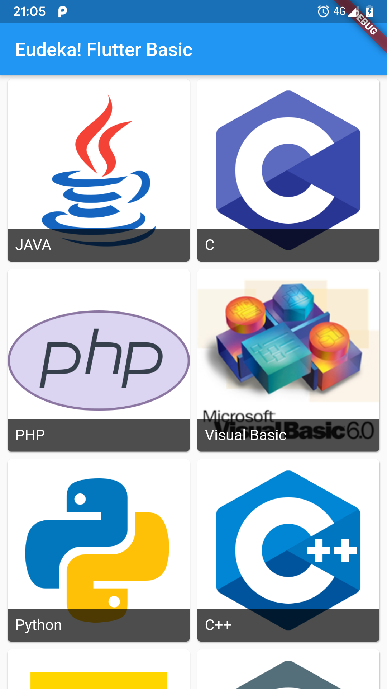
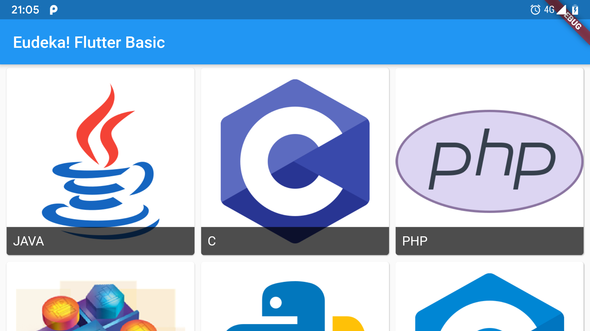
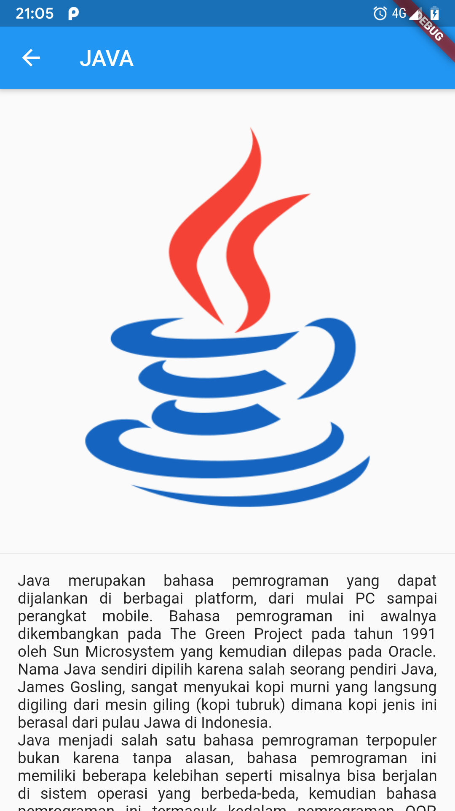
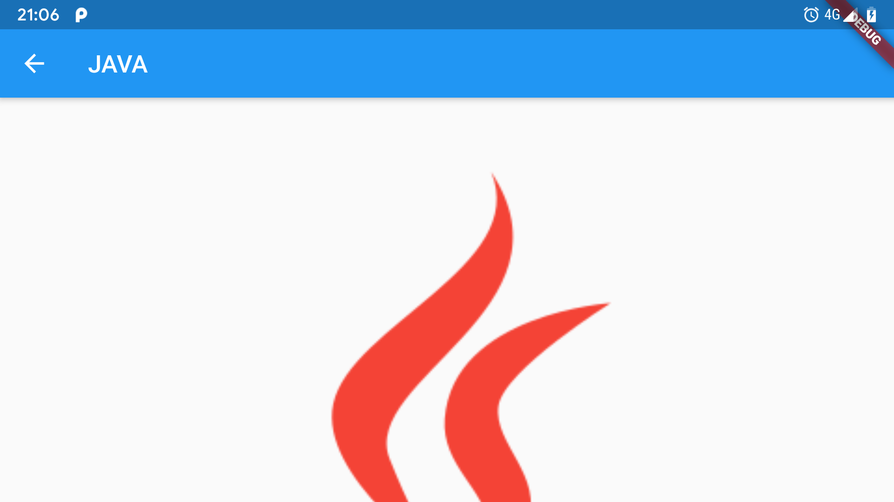

# Flutter Basic Materi 3 - Route, Navigation, dan Scrolling Widget

Pembahasan tugas ke 3 pada OSG Flutter Basic.

## Screenshot

   

## Pembahasan

1. Pertama buat untuk kelas modelnya atau kelas untuk menampung data nantinya.  
    Deklarasikan variabel atau data yang akan kita gunakan, seperti untuk judul, gambar, dan deskripsi. Pada kelas yang tidak meng-extends apapun tidak perlu menjadikan variabel sebagai final.  
    Lalu buat konstruktor untuk kelas model tersebut, yang dimana kita buat semua argumen/parameter didalamnya bersifat opsional dengan membungkusnya lagi menggunakan kurung kurawal `{ }`.  

    ```dart
    class Model {
        String title;
        String imageUrl;
        String description;
        
        Model({
            this.title,
            this.imageUrl,
            this.description,
        });
    }
    ```

2. Kemudian kita isi model tersebut dengan beberapa data, jadikan beberapa data tersebut menjadi sebuah List.  

    ```dart
    List<Model> listModel = [
        Model(
            title: "...",
            imageUrl: "...",
            description: "...",
        ),
        Model(
            title: "...",
            imageUrl: "...",
            description: "...",
        ),
        Model(
            title: "...",
            imageUrl: "...",
            description: "...",
        ),
    ]
    ```

3. Kemudian kita buat untuk tampilan per-item-nya.  
    Dimana kita gunakan widget Card agar tampilannya lebih cantik, berikan clip `antiAliasWithSaveLayer` agar tidak ada widget yang didalam card melebihi card tersebut.  
    Lalu gunakan `InkWell` untuk penanganan aksi `onTap` dan semacamnya, dimana ketika aksi di klik akan berpindah ke halaman selanjutnya (detail) dengan melemparkan data berupa `model`.  
    Didalam `InkWell` kita gunakan `GridTile`, `GridTile` ini juga adalah widget default yang biasa digunakan untuk anak pada `GridView`. Didalam `GridTile` juga sudah terdapat untuk header dan footer, dan kita coba untuk membuat footer berisi Text, untuk menghindari overflow pada Text kita bisa gunakan atribut `overflow`.

    ```dart
    class Item extends StatelessWidget {
        
        [...]
        
        @override
        Widget build(BuildContext context) {
            return Card(
                clipBehavior: Clip.antiAliasWithSaveLayer,
                child: InkWell(
                    child: GridTile(
                        child: Image.network(model.imageUrl),
                        footer: Container(
                            color: Color.fromRGBO(0, 0, 0, 0.7),
                            padding: EdgeInsets.all(8),
                            child: Text(
                                model.title,
                                overflow: TextOverflow.ellipsis,
                                style: TextStyle(
                                    fontSize: 16,
                                    color: Colors.white,
                                ),
                            ),
                        ),
                    ),
                    onTap: () {
                        
                        [...]
                        
                    },
                ),
            );
        }
    }
    ```

4. Kemudian pada halaman utama kita buat supaya berisi GridView.  
    Kita gunakan GridView builder agar perrforma aplikasi lebih baik, karena siap yg menggunakan `.builder` itu sudah dikhususkan untuk data yg sangat banyak, dengan cara kerjanya sama seperti `RecyclerView` pada navite Android, atau dia hanya akan menampilkan data yang memang akan muncul pada layar dan sisanya masuk ke dalam cache, tidak seperti jika menggunakan `.count` atau sebagainya yg akan menampilkan seluruh data baik yg muncul pada layar maupun yg masih berada jauh dibawah layar.  
    Lalu kita gunakan gridDelegate menggunakan `SliverGridDelegateWithMaxCrossAxisExtent` agar jumlah item pada baris lebih fleksibel.  
    Jangan lupa untuk menambahkan itemCount dengan nilai panjang atau banyaknya data.  
    Lalu kita isi itemBuilder dengan kelas `Item` yang tadi sudah kita buat dengan parameter model adalah salah satu data dari listModel sesuai index.

    ```dart
    class HomePage extends StatelessWidget {

        [...]
        
        @override
        Widget build(BuildContext context) {
            return Scaffold(
                appBar: AppBar(
                    title: Text("Eudeka! Flutter Basic"),
                ),
                body: GridView.builder(
                    gridDelegate: SliverGridDelegateWithMaxCrossAxisExtent(
                        maxCrossAxisExtent: 256,
                    ),
                    padding: EdgeInsets.symmetric(
                        horizontal: 4,
                    ),
                    itemCount: _listModel.length,
                    itemBuilder: (BuildContext context, int index) {
                        return Item(
                            model: _listModel[index],
                        );
                    },
                ),
            );
        }
    }
    ```

5. Terakhir kita buat untuk halaman detail.  
    Dimana kita deklarasikan `Model` yang bersifat final karena berada didalam kelas yang immutable (StatelessWidget).  
    Jangan lupa juga untuk membuat konstruktor nya seperti sebelumnya.  
    Lalu kita langsung saja gunakan `ListView` sebagai parent dari semua widget yang ada di dalam body nanti, jadi kita tidak perlu lagi membuat `Column` yang dibungkus oleh `SingleChildScrollView`.

    ```dart
    class DetailPage extends StatelessWidget {
        final Model model;
        
        DetailPage({
            this.model,
        });
        
        @override
        Widget build(BuildContext context) {
            return Scaffold(
                appBar: AppBar(
                    title: Text(model.title),
                ),
                body: ListView(
                    children: <Widget>[
                        
                        [...]
                        
                    ],
                ),
            );
        }
    }
    ```

Untuk kode lengkap nya kamu bisa lihat berikut ini (https://github.com/eudeka/osg06-task3).
